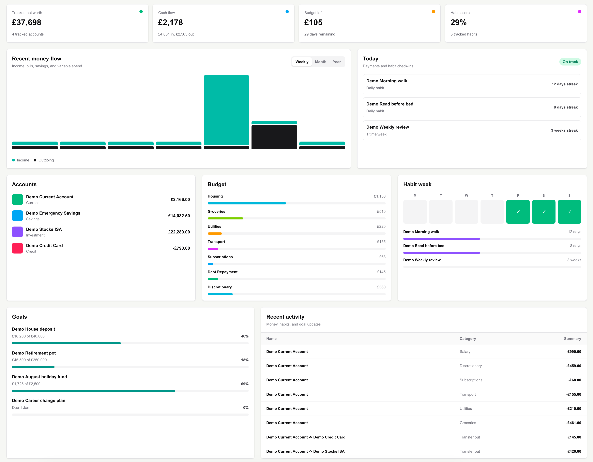
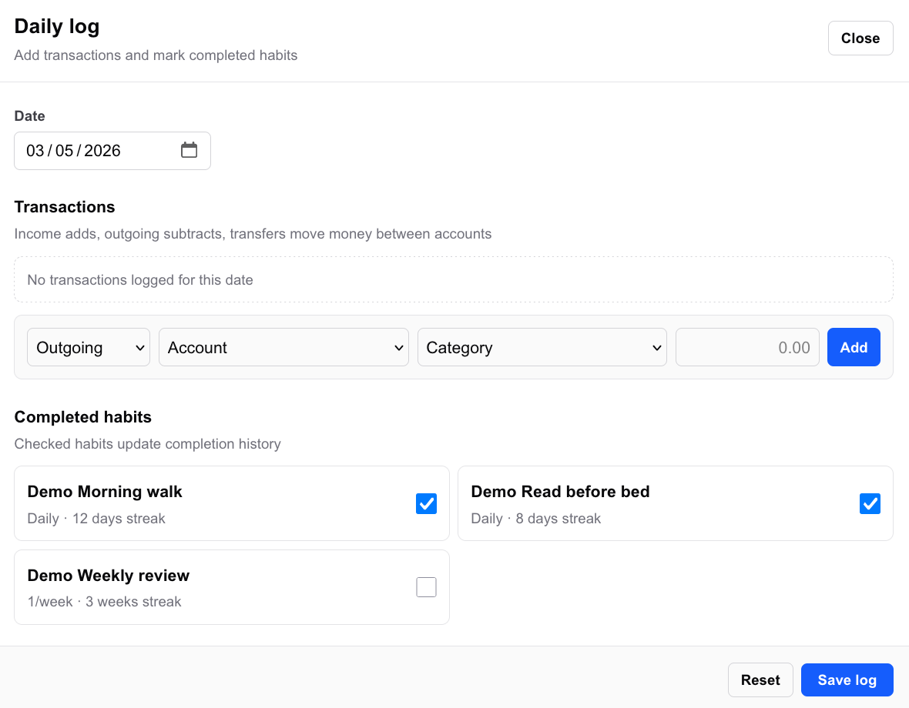
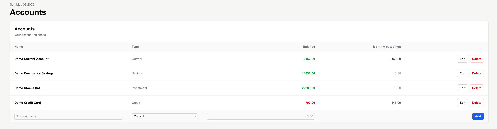
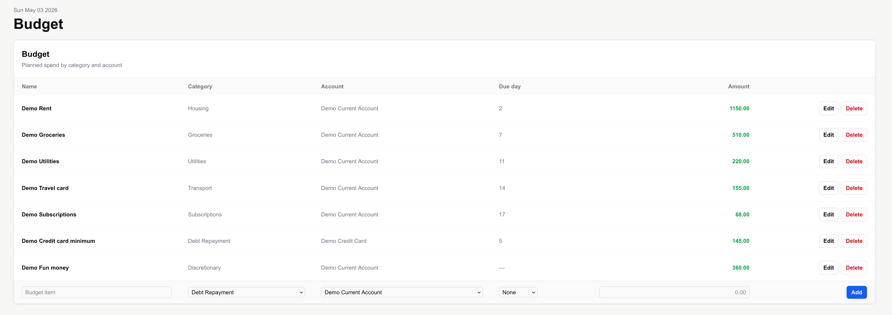
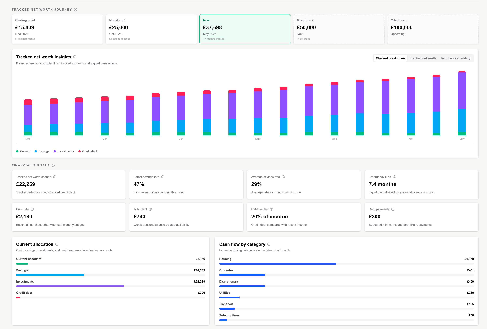
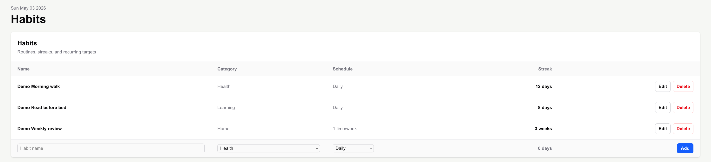
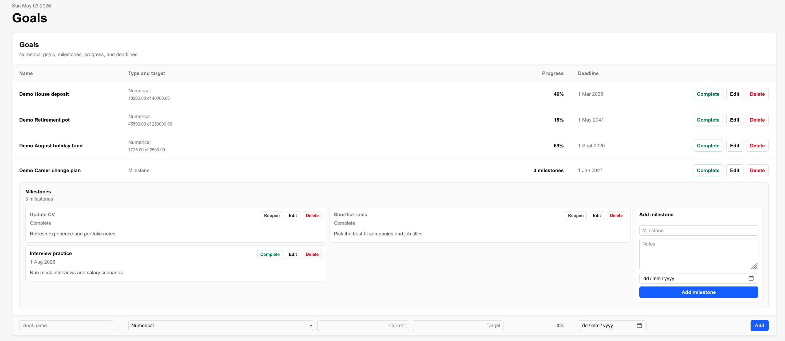
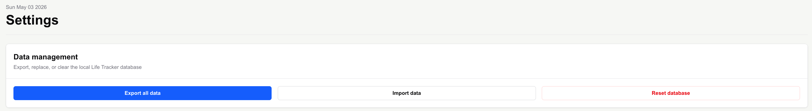

# Life Tracker

Life Tracker is a local-first personal dashboard for tracking money, habits, goals, and daily activity in one place. It runs as a Next.js web app during development and is configured to package as a Tauri desktop app with a local SQLite database.

The project is aimed at personal use rather than multi-user SaaS: data stays on the machine, the schema is versioned with Prisma migrations, and the app includes import/export/reset tools for managing the local database.



## Features

- Overview dashboard for net worth, account balances, budget pressure, habit progress, goals, recent activity, upcoming bills, funding alerts, and a daily quote.
- Account tracking for current, savings, credit, and investment accounts.
- Transaction logging for income, outgoing payments, transfers, habit completions, goal progress, and investment snapshots.
- Budget management with categories, due days, and account-level funding context.
- Habit tracking with daily, weekly, and monthly schedules plus streak calculation.
- Goal tracking for milestone goals and numerical goals, including deadlines and milestone completion.
- Wealth insights based on balances, debt, savings, investments, and historical investment snapshots.
- Local data management: export all data to JSON, import a previous export, or reset the database.
- Repeatable demo-data seeding for screenshots, reviews, and development.
- Tauri desktop packaging that bundles the Next.js standalone server and a local Node runtime.

## Tech Stack

- Next.js 16 with the App Router
- React 19
- TypeScript
- Tailwind CSS
- Prisma 7
- SQLite via `better-sqlite3`
- Tauri 2 for desktop packaging
- Node's built-in test runner

## Getting Started

### Prerequisites

- Node.js 20 or newer
- npm
- Rust/Cargo if you want to run or build the desktop app

### Install

```bash
npm install
cp .env.example .env
npx prisma generate
```

The default `.env.example` points Prisma at a local SQLite database:

```bash
DATABASE_URL="file:./dev.db"
```

`dev.db` is ignored by Git. The app and seed script apply the checked-in SQLite migrations locally, so the database can be recreated from the repository.

### Run the Web App

```bash
npm run dev
```

Open [http://localhost:3000](http://localhost:3000).

### Seed Demo Data

```bash
npm run db:seed:dummy
```

The seed command creates repeatable demo accounts, transactions, budgets, goals, habits, and investment snapshots. It removes and recreates its own demo records without clearing unrelated local data.

## Desktop App

Tauri requires Rust/Cargo. On macOS, Rust can be installed with:

```bash
curl --proto '=https' --tlsv1.2 -sSf https://sh.rustup.rs | sh
```

Restart your terminal, then check:

```bash
cargo --version
rustc --version
```

Run the desktop app in development:

```bash
npm run desktop:dev
```

Build a distributable desktop app for the current operating system:

```bash
npm run desktop:build
```

The desktop build runs `npm run tauri:prepare`, which creates the Next.js standalone server bundle, copies static assets and Prisma migrations, removes local `.env` and database files from the bundle, and copies the local Node runtime into `src-tauri/bin/`.

The packaged app stores its SQLite database in the user's application data folder. Local development uses `dev.db` from the project root.

Linux build machines also need the Tauri native prerequisites, including WebKitGTK 4.1 and librsvg.

## Scripts

```bash
npm run dev            # Start the Next.js development server
npm run build          # Create a production Next.js build
npm run start          # Start the production Next.js server
npm run lint           # Run ESLint
npm test               # Run unit tests
npm run db:seed:dummy  # Seed repeatable local demo data
npm run desktop:dev    # Run the Tauri desktop app in development
npm run desktop:build  # Build the Tauri desktop app
```

Run `npx prisma generate` after installing dependencies or changing `prisma/schema.prisma`. The generated Prisma client lives under `app/generated/prisma` and is intentionally ignored by Git.

## Screenshots

Project screenshots are stored in:

```text
docs/screenshots/
```

### Overview


### Logging



### Money







### Habits And Goals





### Settings




## Project Structure

```text
app/                 Next.js routes, server actions, and UI components
lib/                 Shared business logic and database helpers
prisma/              Prisma schema and SQLite migrations
scripts/             Demo seeding and Tauri build preparation scripts
src-tauri/           Tauri desktop shell and configuration
tests/               Unit tests for money, dates, migrations, habits, and dashboard logic
```

## Current Status

This is a personal local-first tracker, not a hosted product. There is no authentication, syncing, or multi-user support. The repository is structured so a fresh checkout can recreate the local app state from migrations and optional demo data.

## License

No license has been selected yet.
